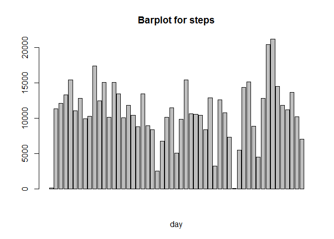
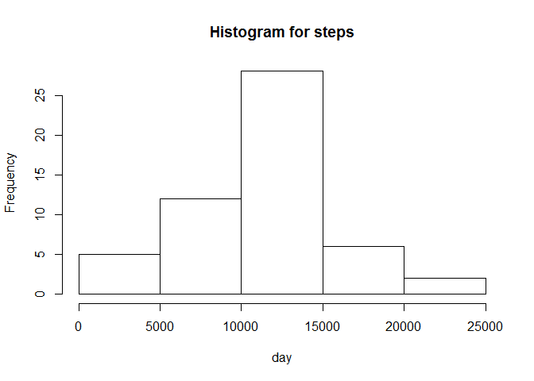
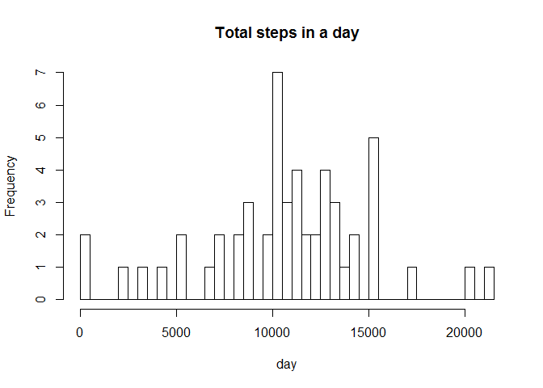
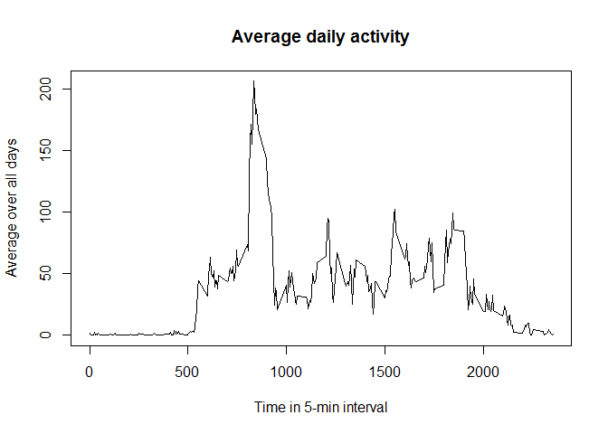
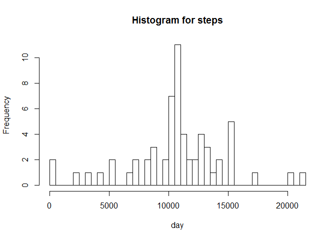
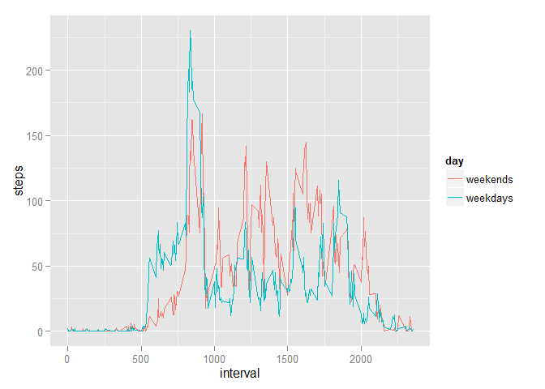

# Reproducible Research: Peer Assessment 1

## Loading and preprocessing the data
First of all we load the data using read.csv and delete the row with for which data is not available. Since the date is in the form of character we can convert it into POSIXct format.


```r
data = read.csv("C:/Users/MadanSumi/Desktop/Coursera/Reproducable/activity/activity.csv")
cleanData = na.omit(data)
cleanData$date = as.POSIXct(cleanData$date)
```
## What is mean total number of steps taken per day?
To calculate total number of steps per day, we aggregrate steps for each individual day. We have plotted both barplot and histogram for each steps of 

```r
sumData = aggregate(steps~date, data, FUN=sum)
barplot(sumData$steps, xlab='day', main = 'Barplot for steps')
```

 

```r
hist(sumData$steps, xlab='day', main='Histogram for steps')
```

 

Barplot plots each individual date as separate category where as histogram makes the date as continious quantity and combine steps from different dates. If we want histogram from different day we need to define number of bins.


```r
hist(sumData$steps, breaks=53, xlab='day', main='Total steps in a day')
```

 

The mean and medium for number of steps per day are given by,


```r
mean(sumData$steps)
```

```
## [1] 10766.19
```

```r
median(sumData$steps)
```

```
## [1] 10765
```

## What is the average daily activity pattern?

The average steps over the all days for each individual time interval can be obtained by using,


```r
aveAtInterval = tapply(data$steps, data$interval, mean, na.rm=TRUE)
plot(row.names(aveAtInterval), aveAtInterval, type="l", xlab="Time in 5-min interval", ylab="Average over all days", main="Average daily activity")
```

 

Here maximum average activity and interval of the day for which maximum activity occurs are, 

```r
max(aveAtInterval)
```

```
## [1] 206.1698
```

```r
names(which.max(aveAtInterval))
```

```
## [1] "835"
```

## Imputing missing values
 The total number of missing values is givn by,

```r
missingValue = sum(is.na(data))
```
Now we can fill the missing value of the data by putting average activity at a given 5-minute intervals.


```r
for (i in 1:nrow(data)){
  if (is.na(data$steps[i])){
    assocInt = data[i, 'interval']
    assocInt = as.character(assocInt)
    data[i, 'steps'] = aveAtInterval[[assocInt]]
  }
}
```

Histogram for a modified data$seps has been plotted. Simlary mean and median of the data has been evaluated below.


```r
sumData = aggregate(steps~date, data, FUN=sum)
hist(sumData$steps, breaks = 53, xlab='day', main='Histogram for steps')
```

 

```r
mean(sumData$steps)
```

```
## [1] 10766.19
```

```r
median(sumData$steps)
```

```
## [1] 10766.19
```

The mean and median of the modified data steps has been slightly different than the origional calculation when 'NA' was ignored.The frequency of the total number of stpes in a day has also been increased slightly for modified data.

##Are there differences in activity patterns between weekdays and weekends?
The average number of steps for 5-min intervals in the case modified data for weekends and weekdays has been presented below. 


```r
days1 = c("Monday", "Tuesday", "Wednesday", "Thursday", "Friday")
data$day = factor((weekdays(as.Date(data$date)) %in% days1), levels=c(FALSE, TRUE), labels=c('weekends', 'weekdays'))
aveSteps = aggregate(steps~interval + day, data=data, mean)

library(ggplot2)
```

```
## Warning: package 'ggplot2' was built under R version 3.2.2
```

```r
ggplot(data=aveSteps, aes(x=interval, y=steps, group=day, color=day)) + geom_line()
```

 


